# S3 Client Lite / R2Desk

**اللغات:** [English](README.md) | [简体中文](README.zh-CN.md) | [Español](README.es.md) | [हिन्दी](README.hi.md) | [العربية](README.ar.md) | [বাংলা](README.bn.md) | [Português](README.pt.md) | [Русский](README.ru.md) | [日本語](README.ja.md) | [Français](README.fr.md)

عميل macOS أصلي لتخزين الكائنات المتوافق مع S3، ومصمم خصوصا لإدارة ملفات Cloudflare R2 اليومية.

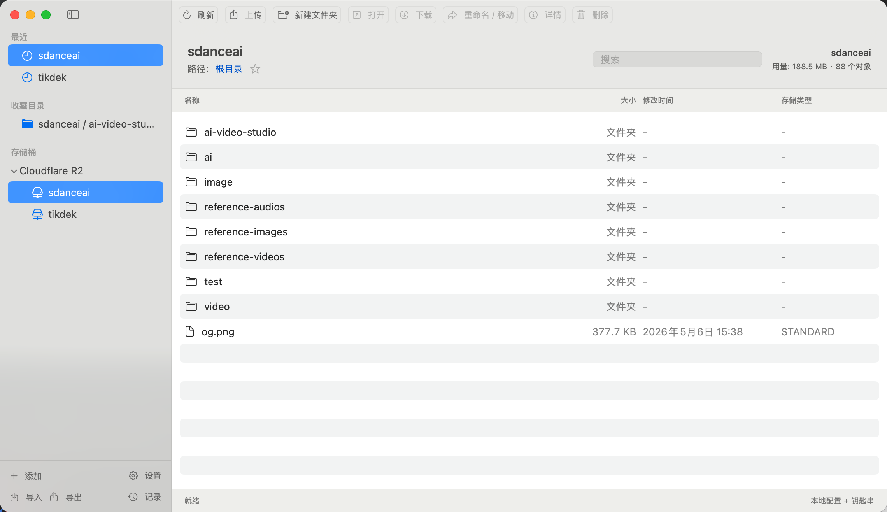

## التنزيل والتشغيل

### من GitHub Actions

كل push يشغل سير بناء macOS ويرفع ملفات جاهزة للتشغيل:

- `R2Desk-macOS.zip`
- `R2Desk-macOS.dmg`

افتح تبويب **Actions** في المستودع، واختر أحدث تشغيل ناجح باسم **Build macOS App**، ثم نزل artifact باسم `R2Desk-macOS`.

### البناء محليا

```bash
swift test
swift build
bash scripts/package_app.sh
```

يتم إنشاء ملفات الحزمة هنا:

- `dist/R2Desk-macOS.zip`
- `dist/R2Desk-macOS.dmg`

### الفتح بدون شهادة Apple Developer

التطبيق موقع بتوقيع ad-hoc، لذلك لا يحتاج إلى شهادة Apple Developer مدفوعة. إذا منع macOS فتح التطبيق بعد تنزيله، انقر بالزر الأيمن على **R2Desk.app** واختر **Open** مرة واحدة.

عند الحاجة:

```bash
xattr -dr com.apple.quarantine /Applications/R2Desk.app
```

## الميزات

### التخزين والـ buckets

- دعم Cloudflare R2 و endpoints المتوافقة مع S3
- إدارة عدة buckets
- Buckets مفضلة وحديثة
- قالب endpoint خاص بـ Cloudflare R2
- اختبار الاتصال قبل حفظ bucket أو بعده
- حفظ الإعدادات محليا في `Application Support/R2Desk/config.json`
- حفظ المفاتيح السرية في macOS Keychain
- استيراد/تصدير الإعدادات بدون تصدير أسرار Keychain

### عمليات الملفات

- عرض الكائنات حسب bucket و prefix
- تصفح شبيه بالمجلدات عبر S3 prefixes
- إنشاء مجلدات
- البحث/التصفية داخل المسار الحالي
- رفع بالسحب والإفلات
- تقدم الرفع، الإلغاء، وإعادة محاولة الرفع الفاشل
- اكتشاف Content-Type تلقائيا عند الرفع
- التعامل مع تعارض الرفع: استبدال أو إعادة تسمية تلقائية
- حذف كائن واحد أو حذف مجموعة من الكائنات المحددة
- تنزيل كائن واحد أو تنزيل مجموعة من الكائنات المحددة
- فتح الكائن الذي تم تنزيله بالتطبيق الافتراضي للنظام
- إعادة تسمية/نقل كائن باستخدام S3 copy + delete
- نسخ object key
- نسخ رابط S3/R2 مباشر
- إنشاء ونسخ رابط تنزيل presigned صالح لمدة ساعة

### الرؤية والإنتاجية

- تفاصيل الكائن: key، الحجم، وقت التعديل، storage class، ETag، Content-Type، metadata
- ملخص استخدام bucket
- سجل عمليات محلي
- إشعارات macOS عند اكتمال الرفع/التنزيل/الحذف
- اختصارات لوحة مفاتيح للتحديث والرفع والتنزيل والحذف والفتح وإنشاء مجلد
- نصوص واجهة بالإنجليزية والصينية
- بناء وتغليف عبر GitHub CI

## إعداد Cloudflare R2

عند إضافة bucket، استخدم:

- Endpoint: `https://<account-id>.r2.cloudflarestorage.com`
- Region: `auto`
- Bucket Name: اسم bucket في R2
- Access Key ID: access key من R2 API token
- Secret Access Key: secret من R2 API token

صلاحيات R2 token الموصى بها:

- Object Read
- Object Write

الحذف يحتاج أيضا إلى صلاحية delete.

## لقطات الشاشة


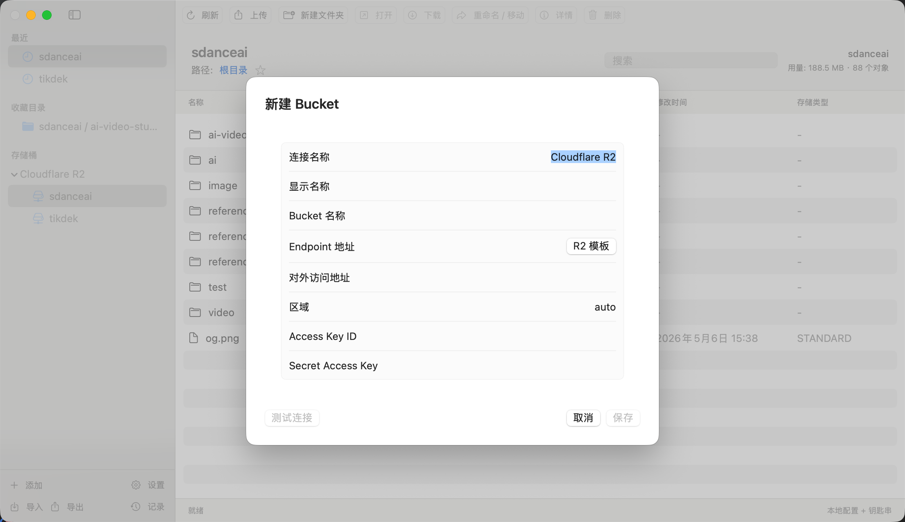
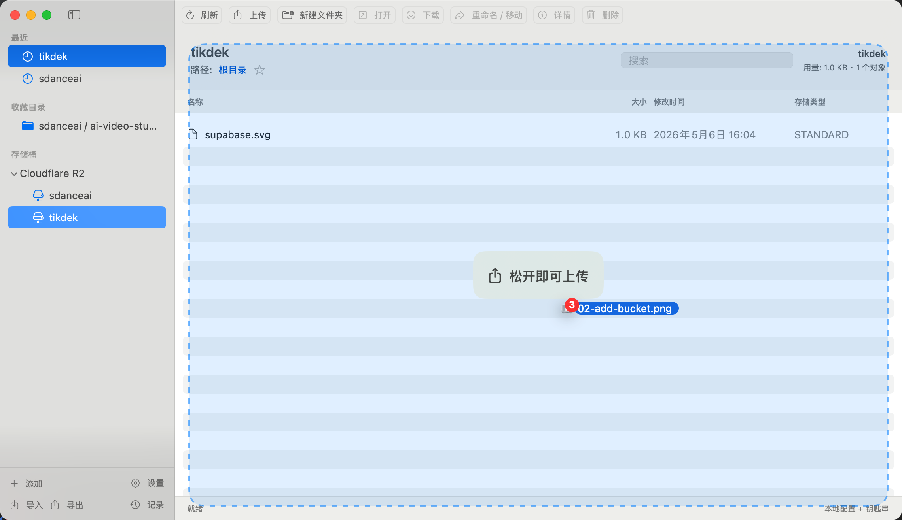
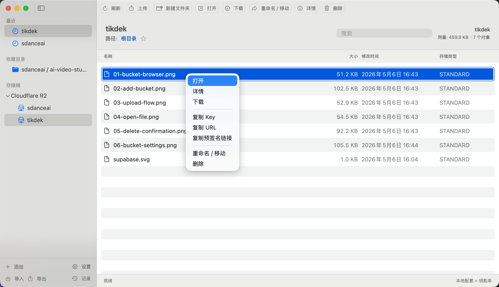
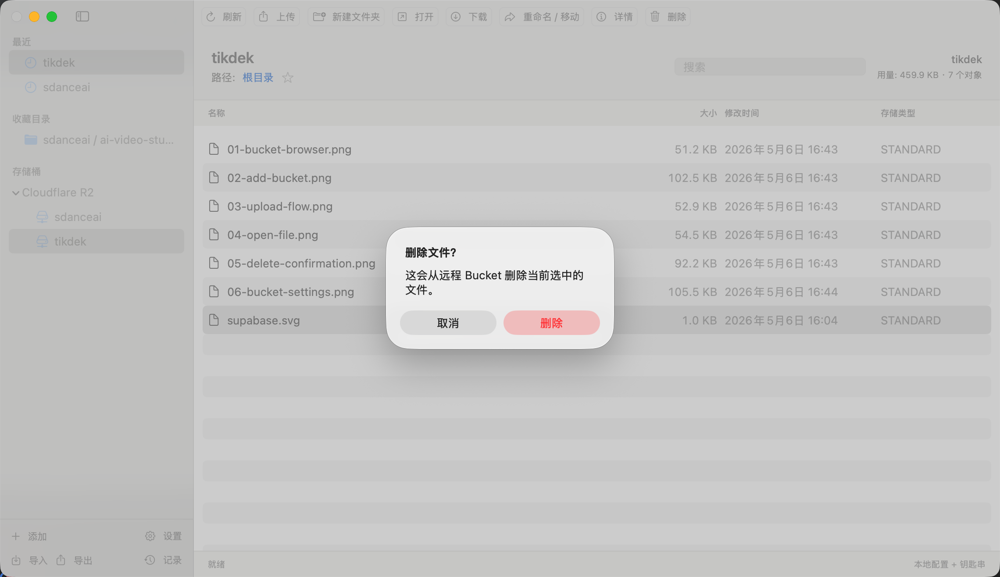
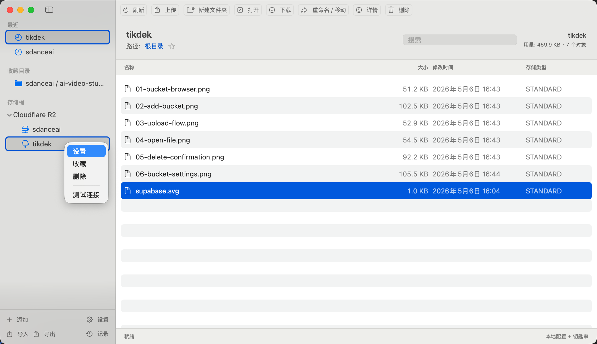
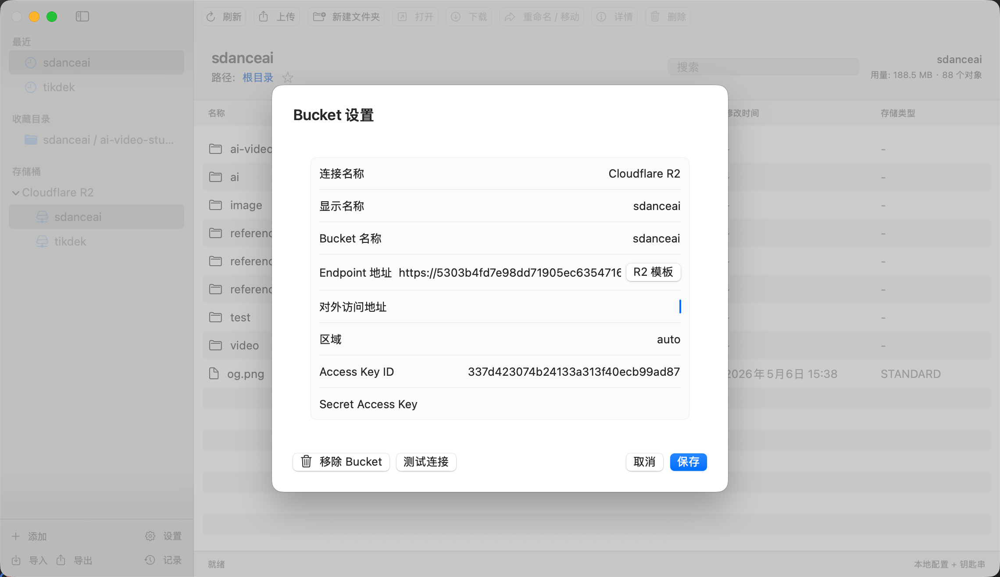
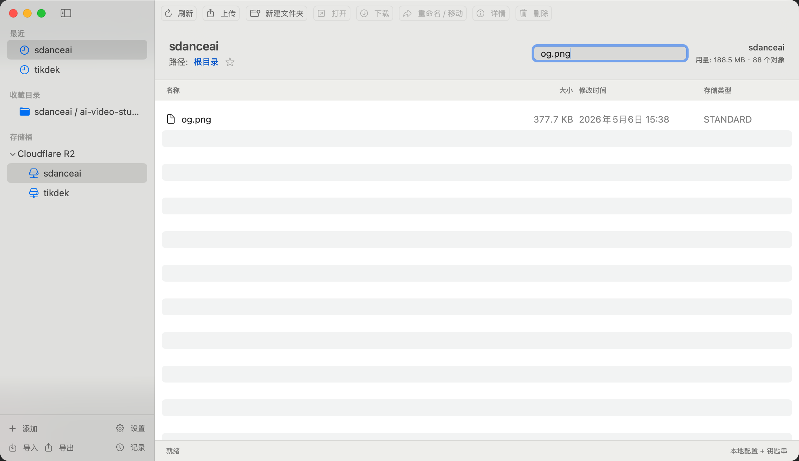

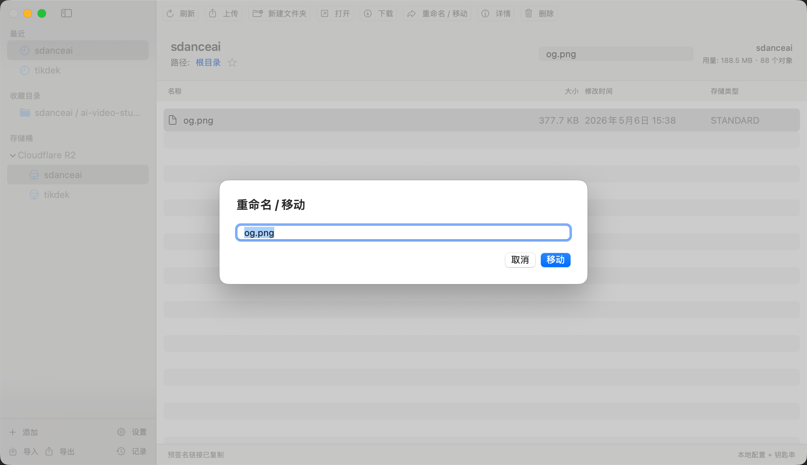
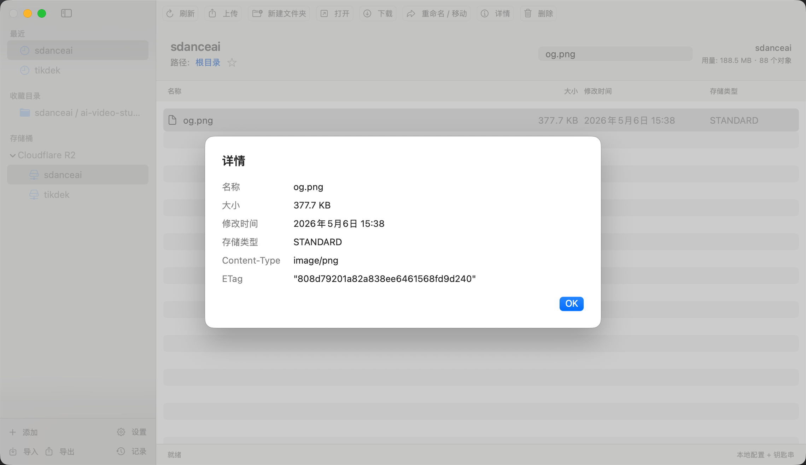
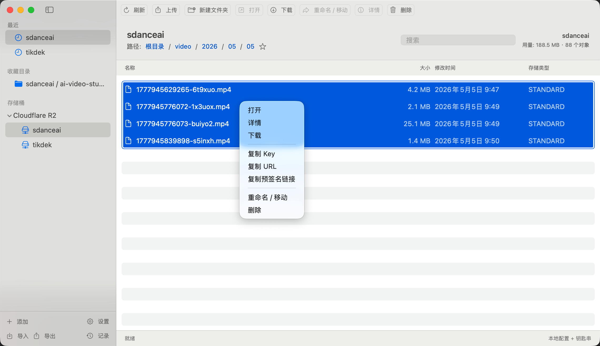
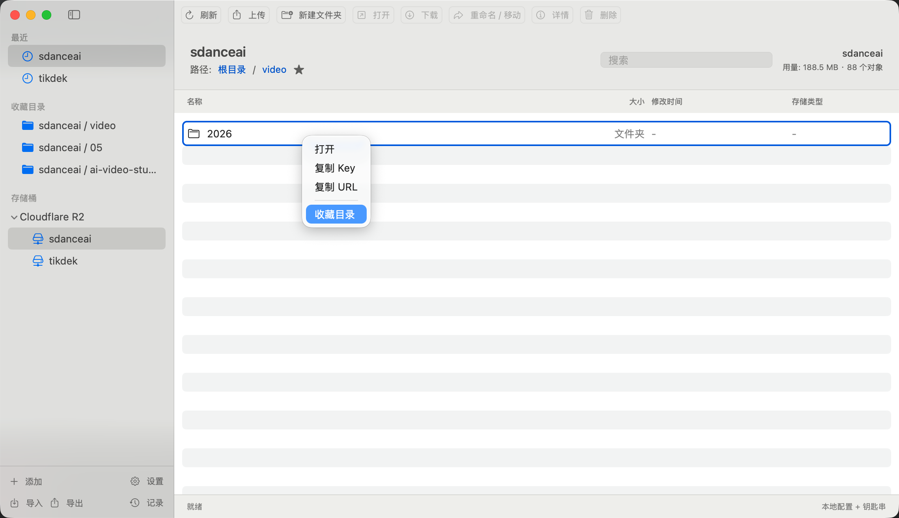
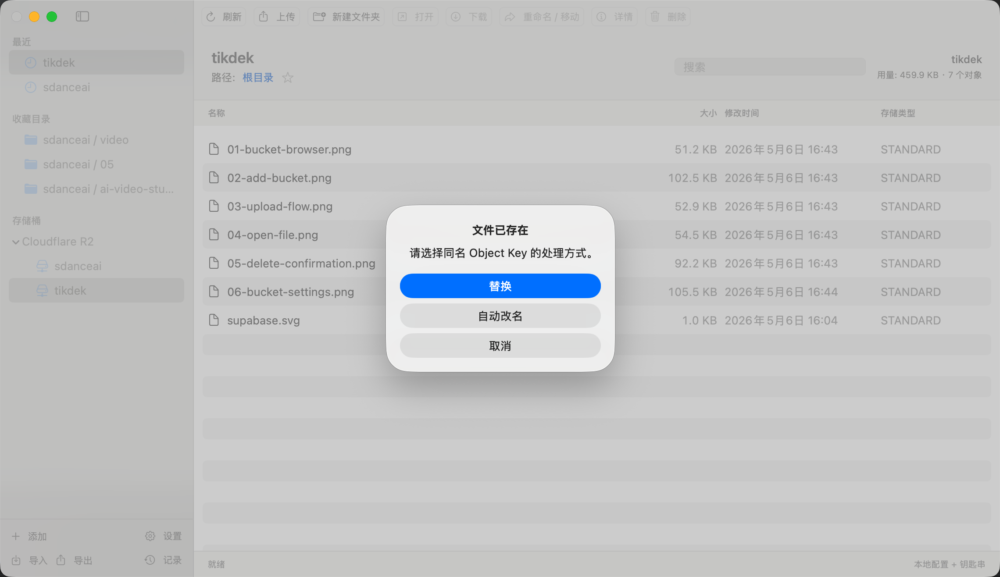
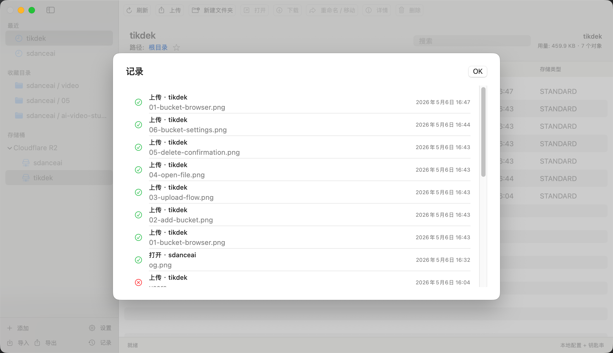

## اختصارات لوحة المفاتيح

| الإجراء | الاختصار |
| --- | --- |
| تحديث | `⌘R` |
| رفع | `⌘U` |
| تنزيل | `⌘D` |
| مجلد جديد | `⇧⌘N` |
| فتح | `Return` |
| حذف | `Delete` |

## البيانات المحلية

يحفظ R2Desk كل بيانات المستخدم على جهاز Mac المحلي:

- إعدادات bucket العامة: `~/Library/Application Support/R2Desk/config.json`
- أسرار الوصول: macOS Keychain
- الملفات المؤقتة المفتوحة: مجلد النظام المؤقت

تصدير الإعدادات لا يتضمن المفاتيح السرية.

## التطوير

```bash
swift test
swift build
bash scripts/package_app.sh
```

سير CI:

- [`.github/workflows/build-macos.yml`](.github/workflows/build-macos.yml)

سكريبت التغليف:

- [`scripts/package_app.sh`](scripts/package_app.sh)
